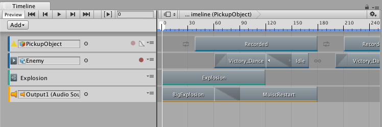

**_NavMeshECS Documentation_**

# About NavMeshECS

The NavMeshECS package includes an ECS system that will use NavMeshQueries to resolve paths for entities. This package also includes a simple example that showcases its use.

# Installing NavMeshECS

To install this package, follow the instructions in the [Package Manager documentation](https://docs.unity3d.com/Packages/com.unity.package-manager-ui@latest/index.html). 

# Using NavMeshECS
>>>
The contents of this section depends on the type of package.

For packages that augment the Unity Editor with additional features, this section should include workflow and/or reference documentation:

* At a minimum, this section should include reference documentation that describes the windows, editors, and properties that the package adds to Unity. This reference documentation should include screen grabs (see how to add screens below), a list of settings, an explanation of what each setting does, and the default values of each setting.
* Ideally, this section should also include a workflow: a list of steps that the user can easily follow that demonstrates how to use the feature. This list of steps should include screen grabs (see how to add screens below) to better describe how to use the feature.

For packages that include sample files, this section may include detailed information on how the user can use these sample files in their projects and scenes. However, workflow diagrams or illustrations could be included if deemed appropriate.

## How to add images

*(This section is for reference. Do not include in the final documentation file)* 

If the [Using &lt;package name&gt;](#UsingPackageName) section includes screen grabs or diagrams, a link to the image must be added to this MD file, before or after the paragraph with the instruction or description that references the image. In addition, a caption should be added to the image link that includes the name of the screen or diagram. All images must be PNG files with underscores for spaces. No animated GIFs.

An example is included below:

Notice that the example screen shot is included in the images folder. All screen grabs and/or diagrams must be added and referenced from the images folder.

For more on the Unity documentation standards for creating and adding screen grabs, see this confluence page: https://confluence.hq.unity3d.com/pages/viewpage.action?pageId=13500715
>>>

# Technical details
## Requirements
>>>
This subtopic includes a bullet list with the compatible versions of Unity. This subtopic may also include additional requirements or recommendations for 3rd party software or hardware. An example includes a dependency on other packages. If you need to include references to non-Unity products, make sure you refer to these products correctly and that all references include the proper trademarks (tm or r)
>>>

This version of &lt;package name&gt; is compatible with the following versions of the Unity Editor:

* 2018.1 and later (recommended)

To use this package, you must have the following 3rd party products:

* &lt;product name and version with trademark or registered trademark.&gt;
* &lt;product name and version with trademark or registered trademark.&gt;
* &lt;product name and version with trademark or registered trademark.&gt;

## Known limitations
>>>
This section lists the known limitations with this version of the package. If there are no known limitations, or if the limitations are trivial, exclude this section. An example is provided.
>>>

&lt;package name&gt; version &lt;package version&gt; includes the following known limitations:

* &lt;brief one-line description of first limitation.&gt;
* &lt;brief one-line description of second limitation.&gt;
* &lt;and so on&gt;

>>>
*Example (For reference. Do not include in the final documentation file):*

The Unity Recorder version 1.0 has the following limitations:*

* The Unity Recorder does not support sound.
* The Recorder window and Recorder properties are not available in standalone players.
* MP4 encoding is only available on Windows.
>>>

## Package contents
>>>
This section includes the location of important files you want the user to know about. For example, if this is a sample package containing textures, models, and materials separated by sample group, you may want to provide the folder location of each group.
>>>

The following table indicates the &lt;describe the breakdown you used here&gt;:

|Location|Description|
|---|---|
|`<folder>`|Contains &lt;describe what the folder contains&gt;.|
|`<file>`|Contains &lt;describe what the file represents or implements&gt;.|

>>>
*Example (For reference. Do not include in the final documentation file):*

The following table indicates the root folder of each type of sample in this package. Each sample's root folder contains its own Materials, Models, or Textures folders:

|Folder Location|Description|
|---|---|
|`WoodenCrate_Orange`|Root folder containing the assets for the orange crates.|
|`WoodenCrate_Mahogany`|Root folder containing the assets for the mahogany crates.|
|`WoodenCrate_Shared`|Root folder containing any material assets shared by all crates.|
>>>

## Document revision history
>>>
This section includes the revision history of the document. The revision history tracks when a document is created, edited, and updated. If you create or update a document, you must add a new row describing the revision.  The Documentation Team also uses this table to track when a document is edited and its editing level. An example is provided:
 
|Date|Reason|
|---|---|
|Sept 12, 2017|Unedited. Published to package.|
|Sept 10, 2017|Document updated for package version 1.1. New features: <li>audio support for capturing MP4s.<li>Instructions on saving Recorder prefabs|
|Sept 5, 2017|Limited edit by Documentation Team. Published to package.|
|Aug 25, 2017|Document created. Matches package version 1.0.|
>>>