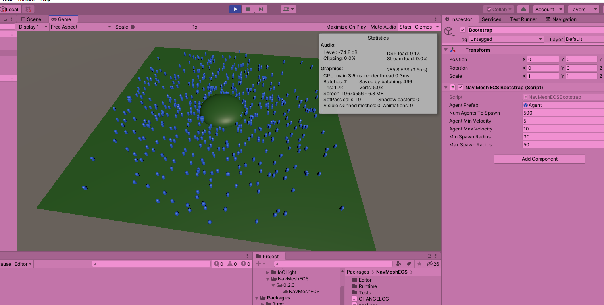

# NavMeshECS

Simple example of some agents running around a simple environment using Unity ECS and NavMeshQueries as jobs aswell as a custom "Simple Stupid Funnel Algorithm" solver for query results.

# FAQ

- **Q: Well I imported the example, but it's all pink and I can't see anything.**

  *A: Make sure your project supports Universal renderpipeline. Usually Going Edit --> Project Settings... --> Graphics and selecting Scriptable Render Pipeline Settings should do it. For convenience there are settings coming with the example. Just click the dropdown saying None(Render Pipeline Asset) and select UniversalRenderPipelineAsset from the list.*
